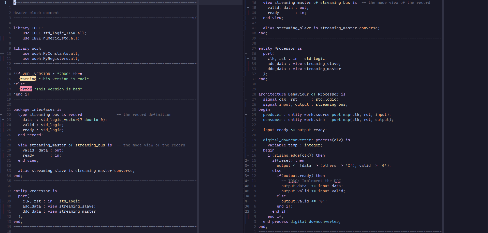
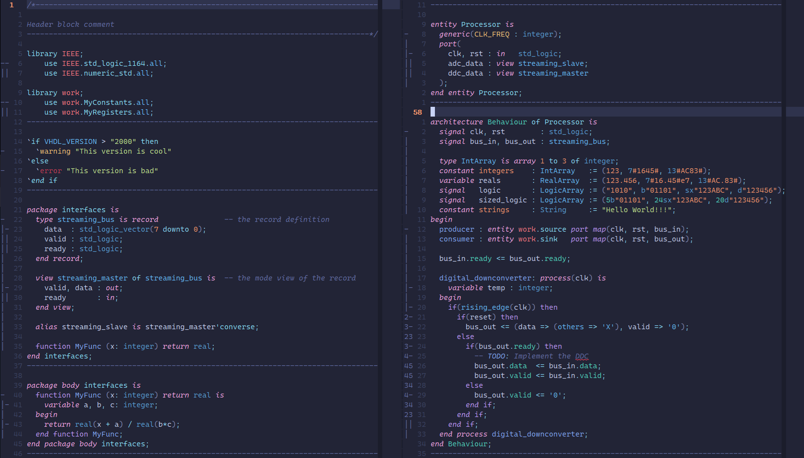
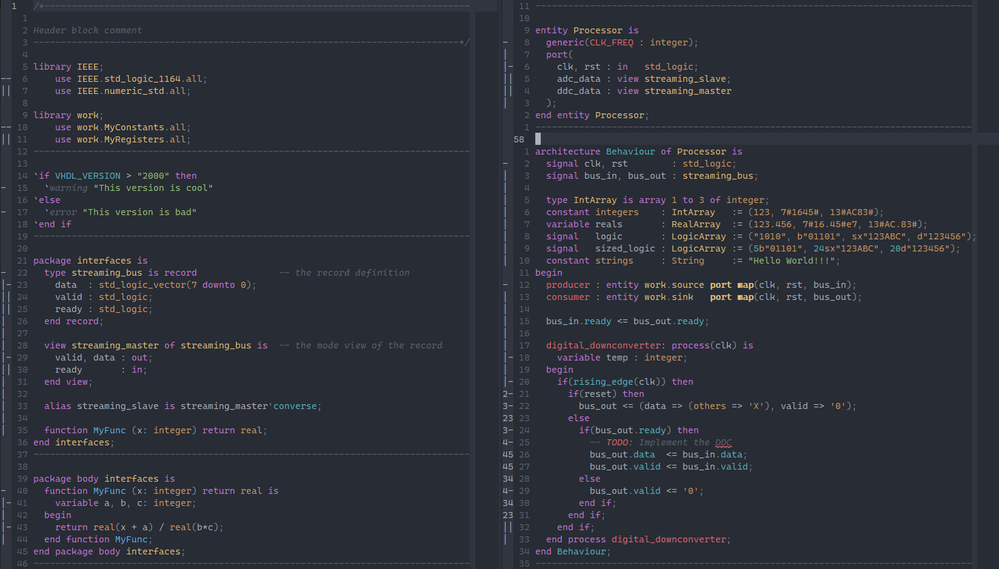

# Tree-sitter-vhdl

[![CI][ci]](https://github.com/jpt13653903/tree-sitter-vhdl/actions/workflows/ci.yml)
[![Fuzz][fuzz]](https://github.com/jpt13653903/tree-sitter-vhdl/actions/workflows/fuzz.yml)
[![matrix][matrix]](https://matrix.to/#/#tree-sitter-chat:matrix.org)
[![pypi][pypi]](https://pypi.org/project/tree-sitter-vhdl/)

A VHDL parser for syntax highlighting.

## References

- [VHDL-2000](https://edg.uchicago.edu/~tang/VHDLref.pdf)
- [VHDL-2008](https://faculty-web.msoe.edu/johnsontimoj/Common/FILES/VHDL_2008.pdf)
- [VHDL-2019](https://doi.org/10.1109/IEEESTD.2019.8938196)
- [VHDL Library Files](https://standards.ieee.org/downloads/) (search for "1076")
- [VSCode Modern VHDL](https://github.com/richjyoung/vscode-modern-vhdl/blob/master/syntaxes/vhdl.tmLanguage.yml)

## Screenshots

[Neovim], using [nvim-treesitter] and a [Catppuccin] colour scheme:



<details><summary>Other colour schemes</summary>

[Neovim], using [nvim-treesitter] and a [Tokyo Night] colour scheme:



[Neovim], using [nvim-treesitter] and a [One Dark] colour scheme:



If you'd like your favourite colour scheme to be listed here,
issue a PR with a new screenshot of [the screenshot example][screenshot]
in the same style and composition as the other screenshots.

</details>

## History

This version started off as a fork of [alemuller/tree-sitter-vhdl][alemuller],
but ended up as a complete rewrite of the parser and highlighting scripts.  It
has very little in common with the original.

## Limitations

This parser uses a simplified grammar, because the full formal grammar in the
VHDL standard is highly ambiguous without compiling the entire code-base into
a symbol table.  In many cases, invalid syntax will parse into a valid tree.

For the same reason, there might be cases where valid syntax does not map
to a valid tree.  In this case, please [log a bug report][issues].

In addition, the following features are not implemented, and are considered
outside the scope of this project.

- IEEE Property Specification Language
- VHDL Procedural Interface

## Neovim Setup Process

This parser has been [merged][NeovimMerge] into the official nvim-treesitter,
so it should work out of the box after adding it to the list of languages to
install.

If you would like to use the `develop` branch instead (because it contains
the latest features that might not have been merged upstream yet), configure
your `treesitter.lua` (or equivalent) as follows:

```lua
local parser_config = require('nvim-treesitter.parsers').get_parser_configs()

parser_config.vhdl = {
  install_info = {
    url = "https://github.com/jpt13653903/tree-sitter-vhdl.git",
    files = { 'src/parser.c', 'src/scanner.c' },
    branch = 'develop',
    generate_requires_npm = false,
    requires_generate_from_grammar = false,
  },
  filetype = 'vhdl',
}

local treesitter = require('nvim-treesitter.configs')

treesitter.setup {
  ensure_installed = {
    -- Some list of languages...
    'vhdl',
    -- Some more languages...
  },

  -- Some other options and configuration...
}
```

Then copy the contents of the `queries/Neovim` folder to your `after/queries/vhdl`
configuration folder, typically `~/.config/nvim/after/queries/vhdl` on Linux
and `~/AppData/Local/nvim/after/queries/vhdl` on Windows.

Finally, run `:TSUpdate`.

If this does not work, change the `url` to a local clone of this repo instead.
The nvim-treesitter installer doesn't always follow the override if the `url`
points to an online repository.

## Helix Setup Process

This parser has been [merged][HelixMerge] into the official Helix repo,
so it should work out of the box.

## Building

- Follow the instructions [here][ts-docs] to setup your development environment.
- Run `npm install --save-dev tree-sitter-cli`
- Add `node_modules/.bin` to your environment path
- Run `tree-sitter generate`
- Run `tree-sitter test`

## Contributing

Contributions are welcome.  Read [Contributing.md] for more information.

[ci]: https://img.shields.io/github/actions/workflow/status/jpt13653903/tree-sitter-vhdl/ci.yml?logo=github&label=CI
[fuzz]: https://img.shields.io/github/actions/workflow/status/jpt13653903/tree-sitter-vhdl/fuzz.yml?logo=github&label=Fuzz
[matrix]: https://img.shields.io/matrix/tree-sitter-chat%3Amatrix.org?logo=matrix&label=matrix
[Neovim]: https://neovim.io/
[nvim-treesitter]: https://github.com/nvim-treesitter/nvim-treesitter
[Catppuccin]: https://github.com/catppuccin/nvim
[Tokyo Night]: https://github.com/folke/tokyonight.nvim
[One Dark]: https://github.com/navarasu/onedark.nvim
[screenshot]: examples/Screenshot.vhd
[alemuller]: https://github.com/alemuller/tree-sitter-vhdl
[issues]: https://github.com/jpt13653903/tree-sitter-vhdl/issues
[helix]: https://github.com/helix-editor/helix
[build_helix]: https://docs.helix-editor.com/install.html#building-from-source
[ts-docs]: https://tree-sitter.github.io/tree-sitter/creating-parsers#getting-started
[Contributing.md]: https://github.com/jpt13653903/tree-sitter-vhdl/blob/master/Contributing.md
[pypi]: https://img.shields.io/pypi/v/tree-sitter-vhdl?logo=pypi&logoColor=ffd242
[NeovimMerge]: https://github.com/nvim-treesitter/nvim-treesitter/pull/6925
[HelixMerge]: https://github.com/helix-editor/helix/pull/13091
